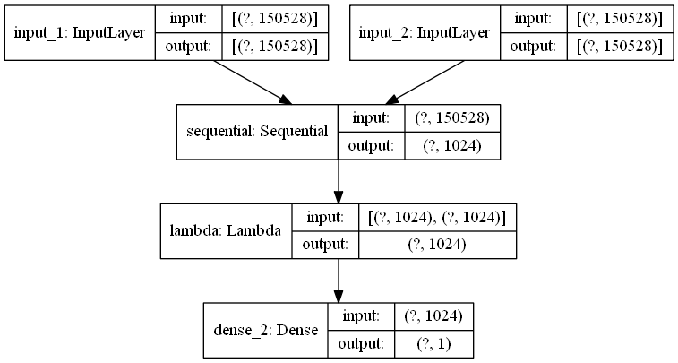

# Palm Recognition using Siamese Network

Amazon is going to commercialise [Amazon One](https://www.theverge.com/2020/9/29/21493094/amazon-one-palm-recognition-hand-payments-amazon-go-store), which is a technology for identifying individuals from their palms. This is similar to the [Kaggle Humpback Whale Identification challenge](https://www.kaggle.com/c/humpback-whale-identification) as well as the [Kaggle Landmark Recognition challenge](https://www.kaggle.com/c/landmark-recognition-2020). The goal of this project is to build a pipeline which allows doing one-shot learning.

## Data
We have built our own dataset by taking pictures of our palms. The folder `images` contains as many folders (denoted p1, p2 and p3) as individuals.
During pre-processing we created synthethic images and stored them in to .jpg format. For convenience, you should upload your images in .jpg format as well.

We trained the model and stored it in the folder `model`.

The image used to test the model is in the folder `test_images`.

## Implementation

We produced a pipeline which works executing the cells in `palm-recognition.ipynb`, after formatting the data as described above. 
We used the following framework f [Fingerprint Recognition](https://github.com/utsav-195/fingerprint-recognition-using-siamese-network-with-retraining)

Make sure you execute the preprocessing part only once.
To deal with One-shot learning we implement Siamese network using Keras. Hereinafter the plot of the model architecture.

## Results
